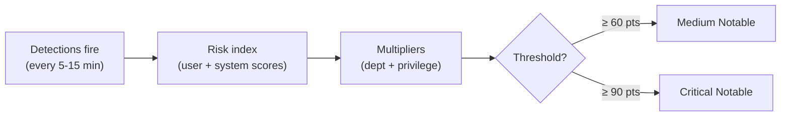
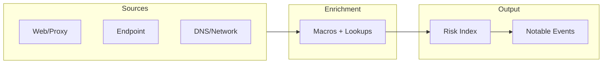

# HDSI AI RBA Detection Pack for Splunk ES

**50 correlation searches that detect unsanctioned and adversarial AI usage — then stack risk signals so only genuinely concerning patterns surface as notables.** Shadow AI browsing, desktop apps, CLI tools, API access, local LLMs, data uploads, agentic AI, MCP servers, behavioral anomalies. Every detection writes dual risk events (user + system) and no single low-signal detection fires a notable on its own.

> [!NOTE]
> **Battle-tested:** Validated against 2 production Splunk ES 8.3.0 environments with real Cisco, Zscaler, FortiGate, and WinEventLog data. 95.7% SPL pass rate (44/46 per environment, 4 expected DLP gaps). See [environment assessment](docs/reviews/environment_fit_assessment.md).

---

## What Does This Detect?

This is not a signature pack that fires on domain matches. It builds behavioral risk profiles across six threat scenarios, and the correlation rules decide when the accumulated evidence justifies analyst attention.

- **Shadow AI browsing** — ChatGPT, Claude, Gemini, DeepSeek, and 67 more providers. Catches web access, DNS resolution, and first-seen provider patterns (AI-028, AI-012, AI-009, AI-042).

- **Data exfiltration to AI services** — Tiered upload detection (1/5/10/50 MB), low-and-slow cumulative tracking, after-hours usage, and volume z-score anomalies (AI-007, AI-044, AI-015, AI-017).

- **Unsanctioned AI tool execution** — CLI tools, desktop apps, local LLMs (Ollama, LM Studio), and code assistants (Cursor, Codeium). Process-level detection via Endpoint data model (AI-004, AI-005, AI-008, AI-011, AI-019).

- **Agentic AI and MCP server activity** — AI agent frameworks, autonomous actions, and MCP server execution. Detects the emerging class of AI tools that can act on your infrastructure (AI-037, AI-039, AI-046).

- **Adversarial AI threats** — Prompt injection patterns in uploads, AI-generated phishing indicators, deepfake tool execution, API key exposure, and compromised AI plugins (AI-030, AI-031, AI-034, AI-033, AI-036).

- **Behavioral anomalies** — Z-score volume anomalies, peer group comparison, time-of-day pattern shifts, and new provider adoption velocity. Statistical baselines that adapt to your environment (AI-017, AI-040, AI-041, AI-042).

---

## How Risk Stacking Works

The whole point: individual detections are deliberately low-scoring. Risk stacking means correlated activity across multiple detections produces notables, while isolated events do not.

**Stacking in practice:**

- **Browsing claude.ai** fires AI-028 (Web) + AI-012 (DNS) + AI-009 (First-Seen) + AI-018 (Multi-Service)
- **Using Cursor IDE** fires AI-005 (Desktop App) + AI-019 (Code Assistant Network) + AI-012 (DNS)
- **Running `ollama run`** fires AI-011 (Local LLM) + AI-014 (Listening Port) + AI-012 (DNS)
- **Large upload by privileged user after hours** fires AI-028 + AI-007 + AI-015 + AI-016 + AI-012
- **MCP server with filesystem access** fires AI-046 (MCP) + AI-039 (Autonomous Actions)
- **Insider data staging** fires AI-043 (Data Access Spike) + AI-007 (Upload) + AI-RISK-003 (Kill Chain)

**Concrete math:** User browses claude.ai: AI-028 (15pts) + AI-012 (12pts) + AI-009 (15pts) = 42pts. Not enough for a notable on its own. But add AI-007 (20pts) for an upload, and you hit 62pts — medium notable fires. A privileged user in a sensitive department gets multiplied further (`department_multiplier * 1.5`), which can push the same activity into critical range.

---

## Quick Start

> [!WARNING]
> Deploy `hdsi_ai_rba_common` FIRST. All detection packages depend on its 7 shared macros.

**Prerequisites:**

- Splunk ES 8.3.0+
- CIM-mapped data sources (Web, Endpoint.Processes minimum)
- Accelerated data models (Web 30d+, Endpoint 7d+)

**Steps:**

1. **Deploy `hdsi_ai_rba_common`** — contains 7 shared macros and lookup definitions required by all detection packages.
2. **Deploy detection packages** — `hdsi_ai_*` and `hdsi_rba_ai_*` packages from `p2r/packages/`.
3. **Install lookups** — copy all 9 CSVs from `lookups/` into the same app context (e.g., `HurricaneLabsContentUpdates`).
4. **Validate CIM mappings** — confirm your proxy, DNS, endpoint, network, DLP, and email sources map correctly to the required data models.
5. **Configure allowlists and thresholds:**
   - `lookups/ai_sanctioned_entities.csv` — sanctioned users, systems, and groups.
   - `lookups/ai_detection_config.csv` — tunable thresholds (upload tiers, risk thresholds, z-scores, time windows).
   - `lookups/ai_department_sensitivity.csv` — department-level risk multipliers.

> [!TIP]
> Start with Tier 1 detections (Web + Endpoint). DLP detections (AI-020, AI-025, AI-030, AI-038) require the Data_Loss_Prevention data model — deploy these only after DLP integration.

---

## Detection Inventory

For sortable/filterable view, see the [interactive dashboard](docs/dashboard.html).

Risk column shows `user_score+system_score` for dual-risk detections.

### Core Detections (AI-004 to AI-021)

| ID | Detection | Risk | MITRE | Data Source |
|---|---|---|---|---|
| AI-004 | Unsanctioned AI CLI execution | 25+15 | T1059.001 | Endpoint |
| AI-005 | Unsanctioned AI desktop app execution | 20+12 | T1204.002 | Endpoint |
| AI-006 | AI API access from non-dev endpoint | 24+14 | T1071.001 | Web |
| AI-007 | High volume upload to AI service (tiered) | 20-80+20 | T1567.002 | Web |
| AI-008 | Scripted AI CLI invocation | 32+18 | T1059.004 | Endpoint |
| AI-009 | First-seen AI provider for user | 15+8 | T1071.001 | Web |
| AI-010 | Repeated unsanctioned AI access burst | 18+10 | T1071.001 | Web |
| AI-011 | Local LLM framework execution | 20+15 | T1204.002 | Endpoint |
| AI-012 | DNS queries to AI domains | 12 | T1071.004 | DNS |
| AI-013 | LLM model file download | 30+18 | T1105 | Web |
| AI-014 | Local LLM listening port detected | 30 | T1571 | Network |
| AI-015 | After-hours AI service usage | 15+8 | T1567.002 | Web |
| AI-016 | Privileged account AI service usage | 40+20 | T1078.004 | Web + Identity |
| AI-017 | AI usage volume anomaly (z-score) | 35 | T1567.002 | Web |
| AI-018 | Multiple AI services in single session | 15+8 | T1567.002 | Web |
| AI-019 | Code assistant network connection | 15 | T1071.001 | Network |
| AI-020 | DLP violation on AI service upload | 60+30 | T1567.002 | DLP |
| AI-021 | AI browser extension activity | 12+8 | T1176 | Web |

### Shadow AI & Policy Bypass (AI-022 to AI-028)

| ID | Detection | Risk | MITRE | Data Source |
|---|---|---|---|---|
| AI-022 | AI access via VPN/proxy evasion | 35+20 | T1090.003 | Web |
| AI-023 | AI access from unmanaged device | 30+25 | T1078.004 | Web + Asset |
| AI-024 | Browser extension high-volume data transmission | 30+15 | T1176 | Web |
| AI-025 | Copy-paste correlation to AI service | 25+12 | T1115 | DLP + Web |
| AI-026 | AI usage from personal account / OAuth mismatch | 28+12 | T1078.004 | Web + Identity |
| AI-027 | Personal email to AI service upload correlation | 30+15 | T1048.002 | Web |
| AI-028 | Unsanctioned AI web access (consolidated) | 15+10 | T1071.001 | Web |

### Adversarial AI Threats (AI-030 to AI-036)

| ID | Detection | Risk | MITRE | Data Source |
|---|---|---|---|---|
| AI-030 | Prompt injection indicators in web uploads | 45+25 | T1190 | DLP |
| AI-031 | AI-generated phishing indicators | 40+20 | T1566.001 | Web + Email |
| AI-032 | Suspicious model file exfiltration from ML infra | 50+30 | T1567.002 | Web |
| AI-033 | AI API key exposure in code/DLP | 55+25 | T1552.001 | Code/DLP |
| AI-034 | Deepfake tool execution/access | 50+30 | T1588.005 | Endpoint |
| AI-035 | AI-assisted lateral movement | 45+25 | T1059.001 | Endpoint |
| AI-036 | Compromised AI plugin/extension installation | 35+20 | T1195.002 | Endpoint + Web |

### Agentic AI & MCP (AI-037 to AI-039, AI-046)

| ID | Detection | Risk | MITRE | Data Source |
|---|---|---|---|---|
| AI-037 | AI agent framework execution | 35+20 | T1059 | Endpoint |
| AI-038 | Sanctioned AI DLP violation | 40+20 | T1567.002 | DLP |
| AI-039 | AI agent autonomous action detection | 40+20 | T1059 | Endpoint |
| AI-046 | MCP server execution | 35+20 | T1059 | Endpoint |

### UEBA Behavioral Baselines (AI-040 to AI-045)

| ID | Detection | Risk | MITRE | Data Source |
|---|---|---|---|---|
| AI-040 | User peer group AI usage anomaly | 30 | T1567.002 | Web + Identity |
| AI-041 | Time-of-day usage pattern anomaly | 25 | T1567.002 | Web |
| AI-042 | New AI provider adoption velocity | 20+10 | T1071.001 | Web |
| AI-043 | AI usage following data access spike | 40+20 | T1567.002 | Endpoint + Web |
| AI-044 | Gradual low-and-slow data exfiltration via AI | 45+20 | T1567.002 | Web |
| AI-045 | Voice cloning API access | 40+20 | T1588.005 | Web |

### RBA Correlation Rules

| ID | Detection | Risk | Data Source |
|---|---|---|---|
| AI-RISK-001 | User risk threshold exceeded — medium | notable | risk index |
| AI-RISK-002 | User risk threshold exceeded — critical | notable | risk index |
| AI-RISK-003 | Data collection to AI upload kill chain | 60 + notable | risk index |
| AI-RISK-004 | Privilege escalation plus AI usage correlation | 70 + notable | risk index |
| AI-RISK-005 | Multi-vector AI risk (3+ categories in 24h) | 55 + notable | risk index |

### Threat Intelligence & Health

| ID | Detection | Data Source |
|---|---|---|
| AI-DISCOVERY-001 | Unknown high-volume external API discovery (disabled) | Web |
| Health — Lookup Staleness | Weekly stale lookup file check | REST API |
| Health — Data Model Availability | Hourly data model event check | Data Models |

Deprecated detection IDs

| ID | Replacement | Notes |
|---|---|---|
| AI-001 | AI-028 | ChatGPT web access merged into consolidated detection |
| AI-002 | AI-028 | Claude web access merged into consolidated detection |
| AI-003 | AI-028 | Gemini web access merged into consolidated detection |

---

## Live Environment Testing

This pack was validated against 2 production Splunk ES 8.3.0 environments running real enterprise data.

| Environment | Ready | Partial | Gaps | Score | Key Sources |
|---|---|---|---|---|---|
| Environment A | 34 | 2 | 5 | 55% | Cisco Cloud Security, Cisco ASA, FortiGate |
| Environment B | 35 | 3 | 4 | 63% | Zscaler NSS, Cisco Estreamer, WinEventLog |

79M web events/day on Environment B, 118K on Environment A. Both environments have populated identity (17K-30K entries) and asset (7K-72K entries) frameworks.

> [!WARNING]
> **Known gaps:** The `Data_Loss_Prevention` data model had zero events in both test environments. The `Endpoint.Filesystem` model was also empty. The `asset_lookup_by_str` is missing the `asset_id` field and `identity_lookup_expanded` is missing the `department` field on both environments — detections still work but enrichment is degraded.

**Tier deployment matrix:**

- **Tier 1 (deploy now):** Web + Endpoint + DNS + Network + Risk correlations — 41 detections
- **Tier 2 (after DLP onboarding):** AI-020, AI-025, AI-030, AI-038
- **Tier 3 (source-specific):** AI-031 (Email), AI-033 (code scanning), AI-043 (Filesystem)

Full details: [Environment assessment](docs/reviews/environment_fit_assessment.md)

---

## Architecture at a Glance

The pack uses 7 shared macros in `hdsi_ai_rba_common`, 9 CSV lookups for provider catalogs and thresholds, and per-detection extension macros (`_filter` and `_customizations`) for site-specific tuning without modifying SPL. Detections run on staggered `*/5` or `*/15` cron intervals with `allow_skew = 5m` and `realtime_schedule = 0`. Suppression periods range from 1 hour (most detections) to 7 days (health checks).

Full details: [Architecture](docs/ARCHITECTURE.md) | [Interactive dashboard](docs/dashboard.html)

---

## Tuning Quick Reference

The defaults are conservative. Observe for 1-2 weeks before adjusting.

| Control | Default | Detection |
|---|---|---|
| Upload tier 1/2/3/4 | 1 / 5 / 10 / 50 MB | AI-007 |
| Request burst count | 10 requests / 15m | AI-010 |
| Medium risk threshold | 60 points / 24h | AI-RISK-001 |
| High risk threshold | 90 points / 24h | AI-RISK-002 |
| After-hours window | 8 PM - 6 AM | AI-015 |
| Multi-service threshold | 3 providers / 1h | AI-018 |
| Volume anomaly z-score | 3.0 | AI-017 |
| Model download threshold | 500 MB | AI-013 |
| Extension data threshold | 10 MB | AI-024 |
| New provider velocity | 3 providers / 7 days | AI-042 |
| Low-and-slow threshold | 50 MB / 7 days | AI-044 |
| Peer group z-score | 2.5 | AI-040 |
| Time anomaly z-score | 3.0 | AI-041 |
| Data access spike | 100 files | AI-043 |
| Kill chain window | 4 hours | AI-RISK-003 |
| Multi-vector categories | 3 categories | AI-RISK-005 |

All thresholds are configurable via `lookups/ai_detection_config.csv`.

> [!TIP]
> Start with defaults. Observe for 1-2 weeks. Target: 1-5 high notables/day, 5-15 medium notables/day. See [TUNING_GUIDE.md](docs/TUNING_GUIDE.md).

---

## Data Model Requirements

| Data Model | Required By |
|---|---|
| `Web` | Most web-based detections |
| `Endpoint.Processes` | AI-004, AI-005, AI-008, AI-011, AI-034-AI-039, AI-046 |
| `Network_Traffic` | AI-014, AI-019 |
| `Network_Resolution` | AI-012 |
| `Data_Loss_Prevention` | AI-020, AI-025, AI-030, AI-038 |
| `Endpoint.Filesystem` | AI-043 |
| `Email` | AI-031 |
| `risk` index | AI-RISK-001 through AI-RISK-005 |
| `identity_lookup_expanded` | AI-016, AI-026, AI-040 |
| `asset_lookup_by_str` | AI-006, AI-022, AI-023, AI-032 |

---

## Documentation

| Document | Description |
|---|---|
| [Interactive Dashboard](docs/dashboard.html) | Sortable detection explorer, MITRE heatmap, kill chain visualization |
| [Architecture](docs/ARCHITECTURE.md) | System design, data flow, macro architecture |
| [Tuning Guide](docs/TUNING_GUIDE.md) | Threshold calibration, FP reduction, performance tuning |
| [Contributing](docs/CONTRIBUTING.md) | Adding detections, P2R packaging, review process |
| [Detection Template](docs/DETECTION_TEMPLATE.md) | Template for new detection development |
| [Runbooks](docs/runbooks/) | 49 investigation runbooks |
| [Environment Assessment](docs/reviews/environment_fit_assessment.md) | Live testing results |
