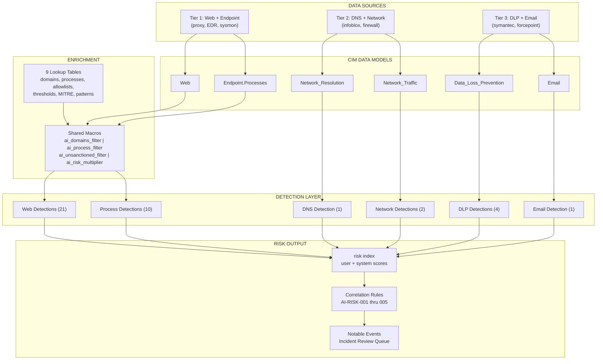
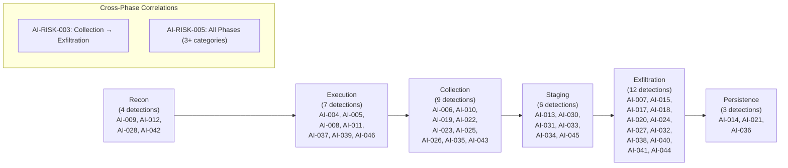
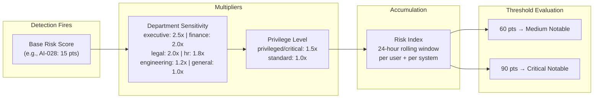
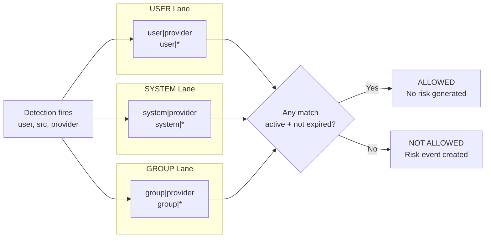

# Architecture

> See also: [Interactive Dashboard](dashboard.html) for a visual exploration of all detections, MITRE coverage, and kill chain mapping.

This document describes the system architecture of the Splunk ES AI RBA Starter Pack, including data flow, component relationships, and design decisions.

## System Overview

The AI RBA Starter Pack is a Splunk ES content pack that detects unsanctioned AI usage using Risk-Based Alerting (RBA). Instead of generating individual alerts for every AI-related event, the pack assigns risk scores to users and systems. Only when cumulative risk exceeds a threshold does the system generate a notable event for SOC review.

### Design Principles

1. **Risk over alerts:** Individual detections contribute risk, not notables. This reduces alert fatigue.
2. **Defense in depth:** Multiple detection layers (web, DNS, process, network, DLP) ensure coverage even when one data source is unavailable.
3. **Signal stacking:** Overlapping detections for the same activity are intentional. A user browsing an AI site generates web, DNS, and potentially first-seen detections, building a composite risk picture.
4. **Configurable thresholds:** All numeric thresholds are externalized to `ai_detection_config.csv` for environment-specific tuning.
5. **Allowlist-first filtering:** The `ai_unsanctioned_filter` macro is the last step in every detection, ensuring sanctioned users/systems are excluded consistently.

## Data Flow

## Kill Chain Coverage

Every detection includes an `ai_kill_chain_phase` field. AI-RISK-003 specifically correlates across the collection-to-exfiltration boundary, detecting data staging followed by AI service upload within a configurable window (default: 4 hours).

## Risk Aggregation Pipeline

**Example:** Finance user (2.0x) with privileged account (1.5x) triggers AI-028 (base 15). Final score: 15 x 2.0 x 1.5 = **45 points**. Two more low-signal detections push them past the 60-point medium threshold.

## Lookup Relationship Diagram

```mermaid
flowchart TD
    subgraph "Policy Lookups"
        L1["ai_sanctioned_entities.csv<br/>Allowlist entries"]
        L2["ai_detection_config.csv<br/>27 tunable thresholds"]
        L3["ai_department_sensitivity.csv<br/>11 department multipliers"]
    end

    subgraph "Intelligence Lookups"
        L4["ai_provider_domains.csv<br/>113 domains, 71 providers"]
        L5["ai_tool_processes.csv<br/>88 process signatures"]
        L6["ai_mitre_mapping.csv<br/>44 technique mappings"]
    end

    subgraph "Pattern Lookups"
        L7["ai_prompt_injection_patterns.csv<br/>25 injection patterns"]
        L8["ai_api_key_patterns.csv<br/>20 key regexes"]
        L9["ai_deepfake_tools.csv<br/>30 tool signatures"]
    end

    subgraph "Consuming Macros"
        M1["ai_domains_filter"]
        M2["ai_process_filter"]
        M3["ai_unsanctioned_filter"]
        M4["ai_risk_multiplier"]
        M5["ai_risk_defaults"]
        M6["ai_prompt_injection_patterns_enabled"]
        M7["ai_api_key_patterns_enabled"]
    end

    L1 --> M3
    L2 --> M5
    L3 --> M4
    L4 --> M1
    L5 --> M2
    L7 --> M6
    L8 --> M7
```

## Allowlist Evaluation Flow

The `ai_unsanctioned_filter` macro performs six parallel lookups against `ai_sanctioned_entities.csv`. If **any** lookup returns an active, non-expired match, the event is filtered out. All six lookups must fail for the event to proceed and generate risk.

## Component Descriptions

### Macros (`default/macros.conf`)

| Macro | Arguments | Purpose |
|---|---|---|
| `ai_domains_filter` | None | Normalizes domain fields and enriches against `ai_provider_domains.csv`. Extracts provider, usage_type, severity_weight, and enabled status. |
| `ai_unsanctioned_filter(3)` | user_field, system_field, provider_field | Six-way allowlist evaluation against `ai_sanctioned_entities.csv`. Checks user, system, and group entries with provider-specific and wildcard matching. Enforces enabled status and expiration dates. |
| `ai_process_filter` | None | Enriches process names against `ai_tool_processes.csv` to resolve tool name, provider, usage type, and enabled status. |
| `ai_risk_defaults(1)` | control_name | Retrieves a single configuration value from `ai_detection_config.csv`. Used for threshold lookups. |

### Lookups (`lookups/`)

| File | Records | Purpose |
|---|---|---|
| `ai_provider_domains.csv` | 52 domains | Maps AI domains to providers, usage types (web/api/ide/cli/local_llm), severity weights, and enabled flags. |
| `ai_tool_processes.csv` | 80+ processes | Maps process names and original file names to AI tools, providers, platforms, and usage types. |
| `ai_sanctioned_entities.csv` | Variable | Allowlist entries for users, systems, and groups. Supports provider-specific and wildcard scoping with expiration dates. |
| `ai_detection_config.csv` | 25 controls | Tunable thresholds for all configurable detections. Centralized configuration avoids editing savedsearches.conf. |
| `ai_mitre_mapping.csv` | 38 mappings | Maps detection IDs to MITRE ATT&CK technique IDs, names, and tactics. |

### Detection Categories

| Category | IDs | Data Model | Description |
|---|---|---|---|
| Web Access | AI-028 | Web | Direct browsing to AI web properties |
| CLI Execution | AI-004, AI-008 | Endpoint.Processes | AI CLI tools launched from terminal or scripts |
| Desktop Apps | AI-005 | Endpoint.Processes | AI desktop applications (ChatGPT, Cursor, etc.) |
| API Access | AI-006 | Web | AI API calls from non-development endpoints |
| Data Upload | AI-007 | Web | High-volume data uploads to AI services |
| First-Seen | AI-009 | Web | New AI provider usage per user |
| Burst Activity | AI-010 | Web | Rapid request volume to AI services |
| Local LLM | AI-011, AI-014 | Endpoint.Processes, Network_Traffic | Local LLM framework execution and server ports |
| DNS | AI-012 | Network_Resolution | DNS resolution of AI domains |
| Model Download | AI-013 | Web | Download of LLM model files |
| After-Hours | AI-015 | Web | AI usage outside business hours |
| Privileged | AI-016 | Web + Identity | AI usage by privileged accounts |
| Volume Anomaly | AI-017 | Web | Statistical z-score anomaly detection |
| Multi-Service | AI-018 | Web | Multiple AI providers in one session |
| Code Assistant | AI-019 | Network_Traffic | IDE network connections to AI backends |
| DLP Correlation | AI-020 | Data_Loss_Prevention | DLP violations targeting AI services |
| Browser Extension | AI-021 | Web | AI browser extension activity |
| Risk Aggregation | AI-RISK-001, AI-RISK-002 | risk index | Cumulative risk threshold notables |

## Data Model Dependencies

| Data Model | Required By | Fields Used | Acceleration |
|---|---|---|---|
| Web | AI-006, AI-007, AI-009, AI-010, AI-013, AI-015-018, AI-020-024, AI-026-028, AI-031-032, AI-036, AI-040-042, AI-044, AI-DISCOVERY-001 | url_domain, user, src, dest, bytes_out, bytes_in, url, http_user_agent, http_method | Recommended |
| Endpoint.Processes | AI-004, AI-005, AI-008, AI-011, AI-034-036 | user, dest, process_name, parent_process_name, process, parent_process, process_path, original_file_name | Recommended |
| Network_Resolution | AI-012 | src, query, record_type | Recommended |
| Network_Traffic | AI-014, AI-019 | src, dest, dest_port, transport, app, src_ip, dest_ip | Recommended |
| Data_Loss_Prevention | AI-020, AI-025, AI-030 | user, src, dest, file_name, dlp_type, file_content | Recommended |
| risk (index) | AI-RISK-001, AI-RISK-002 | search_name, risk_object, risk_object_type, risk_score | N/A |
| identity_lookup_expanded | AI-016, AI-026, AI-040 | identity, category, priority, department | N/A (ES managed) |
| asset_lookup_by_str | AI-006, AI-022, AI-023, AI-032 | ip, category, asset_id, is_expected | N/A (ES managed) |

## Scheduling Architecture

The detection scheduling is tiered by resource impact and urgency:

| Tier | Schedule | Detections | Rationale |
|---|---|---|---|
| Real-time (5 min) | `*/5 * * * *` | Most detections (AI-004 through AI-036, AI-043) | Near-real-time detection for active threats |
| Frequent (15 min) | `*/15 * * * *` | AI-009, AI-RISK-001/002/003/004/005 | Longer lookback or aggregation windows |
| Daily | `30 3 * * *`, `30 4 * * *`, `45 4 * * *`, `0 5 * * *`, `0 6 * * *` | AI-017, AI-040, AI-041, AI-042, AI-044 | Resource-intensive baseline computations run off-peak |

All detections use `alert.suppress` to prevent alert flooding within their respective suppress periods (1h for most, 2-4h for risk thresholds, 24h for first-seen and anomaly).
